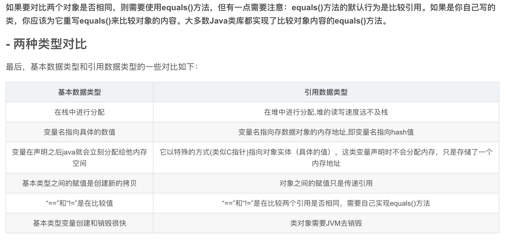
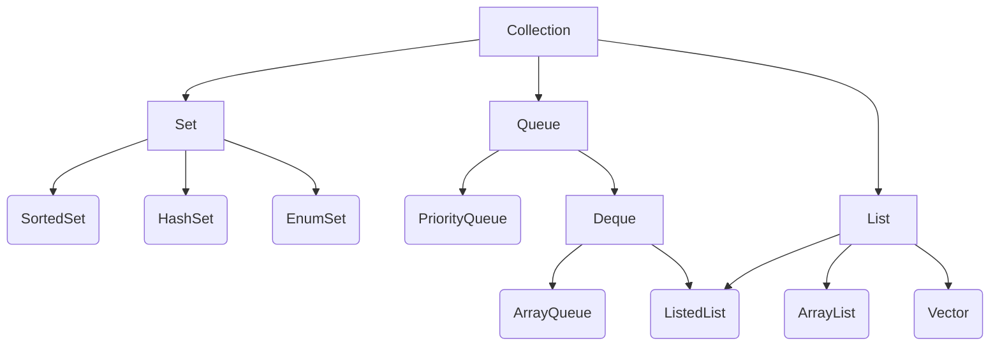
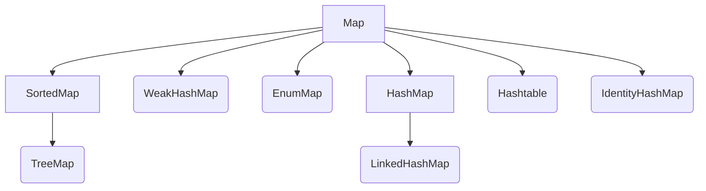
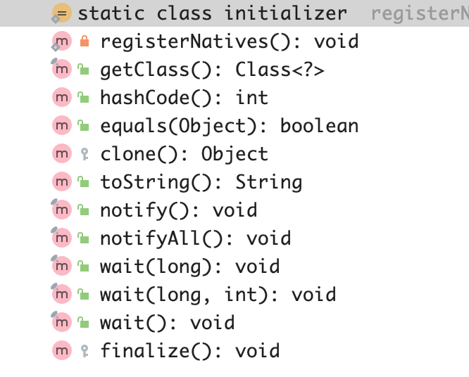

# 面试
## 2.24电话面试
#### **1.jvm相关**
#### **2.基本数据类型**
    8种基本的数据类型 （值类型）
    byte 8位  Byte
    short 16位 Short
    long 64位 Long
    int 32位  Integer
    double 64位 Double
    float 32位 FLoat
    boolean true false Boolean
    char 16位 Character

**引用类型**
    数组 类 Interface Enum String StringBuffer ArrayList HashSet HashMap等其他除去基本数据类型的都是引用类型

#### **3.子类继承父类的方法，关键字范围，加载顺序**
   **结论：**
   父类静态属性 > 父类静态代码块 > 子类属性 > 子类静态代码块 > 父类的非静态属性 > 父类的非静态代码块 > 父类的构造函数 > 子类的非静态属性 > 子类的非静态代码块 > 子类的构造函数

   **原理：**
    静态属性和代码块当且仅当该类第一次被new或者被类加载器加载的时候才会触发，即静态优于非静态；
    属性（成员变量）优于构造函数，加载这整个类，需要先知道类具有哪些属性，并且这些属性初始化完毕之后，这个类的对象才算是完整的。另外，非静态代码块其实就是对象 new 的准备工作之一，算是一个不接受任何外来参数的构造方法。因此，属性 > 非静态代码块 > 构造方法。
   

#### 4.http和tcp关系,保持长连接的请求头是什么
  tcp是传输层协议，http是应用层的协议，客户端通过http向服务层发送请求的时候，需要通过tcp协议完成数据的传输
  **tcp的三次握手：**

* 第一次握手：客户端发送syn包(syn=j)到服务器，并进入SYN_SEND状态，等待服务器确认;

* 第二次握手：服务器收到syn包，必须确认客户的SYN(ack=j+1)，同时自己也发送一个SYN包(syn=k)，即SYN+ACK包，此时服务器进入SYN_RECV状态;

* 第三次握手：客户端收到服务器的SYN+ACK包，向服务器发送确认包ACK(ack=k+1)，此包发送完毕，客户端和服务器进入ESTABLISHED状态，完成三次握手。
***http保持长连接的请求头：`Connection: Keep-Alive`***

#### 5.dubbo的rpc是http还是tcp
dubbo是基于RPC的远程调用框架，既不是http也不是tcp，rpc是通过本地接口调用远程服实现（dubbo的原理图）
#### 6.客户端连接服务端除了http还有哪些方式
websocket
#### 7.常用的关键字
访问控制修饰符
`default` `private` `public` `protected`

`protected`
* 子类与基类在同一包中：被声明为 protected 的变量、方法和构造器能被同一个包中的任何其他类访问；

* 子类与基类不在同一包中：那么在子类中，子类实例可以访问其从基类继承而来的 protected 方法，而不能访问基类实例的protected方法。

`static`
修饰静态变量和静态方法

`final`
final 表示"最后的、最终的"含义，变量一旦赋值后，不能被重新赋值。被 final 修饰的实例变量必须显式指定初始值。
final 修饰符通常和 static 修饰符一起使用来创建类常量。
final 类不能被继承，没有类能够继承 final 类的任何特性。

`abstract`
抽象类不能用来实例化对象，声明抽象类的唯一目的是为了将来对该类进行扩充。

`synchronized` `volatile`
锁相关

#### 8.谈谈面向对象的理解
《Java编程思想》中提到“万物皆为对象”的概念。它将对象视为一种奇特的变量，它除了可以存储数据之外还可以对它自身进行操作。它能够直接反映现实生活中的事物，例如人、车、小鸟等，将其表示为程序中的对象。每个对象都具有各自的状态特征（也可以称为属性）及行为特征（方法），java就是通过对象之间行为的交互来解决问题的。
面向对象就是把构成问题的事物分解成一个个对象，建立对象不是为了实现一个步骤，而是为了描述某个事物在解决问题中的行为。
类是面向对象中的一个很重要的概念，因为类是很多个具有相同属性和行为特征的对象所抽象出来的，对象是类的一个实例。
类具有三个特性：封装、继承和多态。

**封装**：核心思想就是“隐藏细节”、“数据安全”，将对象不需要让外界访问的成员变量和方法私有化，只提供符合开发者意愿的公有方法来访问这些数据和逻辑，保证了数据的安全和程序的稳定。
**继承**：子类可以继承父类的属性和方法，并对其进行拓展。
**多态**：同一种类型的对象执行同一个方法时可以表现出不同的行为特征。通过继承的上下转型、接口的回调以及方法的重写和重载可以实现多态。

#### 9.interface和abstract的区别和联系
抽象类（abstract class）：
使用abstract修饰符修饰的类。官方点的定义就是：如果一个类没有包含足够多的信息来描述一个具体的对象，这样的类就是抽象类。

实际点来说，一个抽象类不能实例化，因为“没有包含足够多的信息来描述一个具体的对象”。但终归属于类，所以仍然拥有普通类一样的定义。依然可以在类的实体（直白点就是能在｛｝里面)定义成员变量，成员方法，构造方法等。

那么可能初学者会问：既然不能实例化，那么在类里面定义成员方法，成员变量有什么用。

抽象类在实际应用中，更多的是因为类中有抽象方法。抽象方法：只声明，不实现。具体的实现由继承它的子类来实现。实际点就是：被abstract修饰的方法，只有方法名没有方法实现，具体的实现要由子类实现。方法名后面直接跟一个分号，而不是花括号。例如：public abstract int A();

一个类中含有抽象方法（被abstract修饰），那么这个类必须被声明为抽象类（被abstract修饰）。

有关抽象类的基础知识可以查看  www.runoob.com/java/java-abstraction.html

接口（interface）：
官方定义：接口在java中是一个抽象类型，是抽象方法的集合。一个类通过继承接口的方式，从而继承接口的抽象方法。

从定义上看，接口是个集合，并不是类。类描述了属性和方法，而接口只包含方法（未实现的方法）。接口和抽象类一样不能被实例化，因为不是类。但是接口可以被实现（使用 implements 关键字）。实现某个接口的类必须在类中实现该接口的全部方法。虽然接口内的方法都是抽象的（和抽象方法很像，没有实现）但是不需要abstract关键字。

接口中没有构造方式（因为接口不是类）

接口中的方法必须是抽象的（不能实现）

接口中除了static、final变量，不能有其他变量

接口支持多继承（一个类可以实现多个接口）

有关接口的更详细的基础知识可以参考：  www.runoob.com/java/java-interfaces.html

抽象类和接口的区别：

默认的方法实现 
抽象类可以有默认的方法实现完全是抽象的。接口根本不存在方法的实现。
抽象类中可以有已经实现了的方法，也可以有被abstract修饰的方法（抽象方法），因为存在抽象方法，所以该类必须是抽象类。但是接口要求只能包含抽象方法，抽象方法是指没有实现的方法。所以就不能像抽象类那么无赖了，接口就根本不能存在方法的实现。

实现 抽象类使用extends关键字来继承抽象类。如果子类不是抽象类的话，它需要提供抽象类中所有声明的方法的实现。子类使用关键字implements来实现接口。它需要提供接口中所有声明的方法的实现。
抽象类虽然不能实例化来使用，但是可以被继承，让子类来具体实现父类的所有抽象方法。有点老子没完成的梦想交给儿子来完成，但是如果子类将抽象方法没有全部实现，就必须把自己也修饰成抽象类，交于继承它的子类来完成实现。就相当于，儿子能力不够也没完成老爹的梦想，现在儿子等着再生儿子（被继承），然后让孙子去完成。以此类推，知道没有抽象函数。

接口的实现，通过implements关键字。实现该接口的类，必须把接口中的所有方法给实现。不能再推给下一代。和抽象类相比，抽象类是将梦想传给家族，一代一代去完成。那么接口就是掌门人找大师兄来完成帮派的鸿星伟业，这时候就只有一次希望，要么有能力就实现，没能力就不要接。

抽象类可以有构造器，而接口不能有构造器
这个原因很简单，我们回到双方的定义上来，抽象类再怎么流氓无赖也好，终究是属于类，就天生享有类的所有特性（但是不能实例化），当然包括类的构造方法，也就是构造器。

但是接口是所有抽象方法的集合，注意，是集合，不是类。当然没有构造方法一说，更别提什么构造器了。

抽象方法可以有public、protected和default这些修饰符 
接口方法默认修饰符是public。你不可以使用其它修饰符。
抽象类的目的就是被继承，抽象方法就是为了被重写，所以肯定不能用private修饰符，肯定是可以用public的。但是protected和default也是可以的。

接口就有且只有一个public修饰。

（是不是感觉抽象类像小儿子各种耍无赖，接口就像私生子，说什么只能是什么）

抽象类在java语言中所表示的是一种继承关系，一个子类只能存在一个父类，但是可以存在多个接口。
java在类的继承上并没有多继承。抽象类属于类，所以可以被继承。但子类只能继承一个父类。java为了实现多继承，使用了接口。一个类可以实现多个接口。继承就好比生了孩子，只能有一个爹，但是这个孩子可以学语文，学数学，学英语等等很多东西，而语文、数学、英语就相当于接口。

总的来说，因为java中抽象类只有单继承，接口就可以实现多继承。

抽象方法比接口速度要快
接口是稍微有点慢的，因为它需要时间去寻找在类中实现的方法。
记住抽象方法是小儿子，从小吃的好所以跑的快，接口是私生子，从小日子苦，营养不良。

如果你往抽象类中添加新的方法，你可以给它提供默认的实现。因此你不需要改变你现在的代码。 如果你往接口中添加方法，那么你必须改变实现该接口的类。
抽象类可以有一些非抽象方法的存在，这些方法被称为默认实现。如果添加一个默认实现方法（不能是抽象方法），就不需要在子类中去实现，所以继承这个抽象类的子类无须改动。

但是，接口中只能添加抽象方法，当你添加了抽象方法，实现该接口的类就必须实现这个新添加的方法。因为，定义中说的很清楚，接口的实现必须实现所有的方法。所有，当然包括新添加的方法。

#### 10.数组、链表、队列、栈的区别和联系，java中具体实现有哪些
**概念：**
`数据结构` 数据结构是指相互之间存在一种或者多种特定关系的数据元素的集合。
    **队列** 是一种先进先出的逻辑结构
    **栈** 是一种先进后出的逻辑结构

`数据存储结构` 描述计算机中存储方式的
    **数组**是在连续空间中存储数据的存储方式
    **链表**是在不连续空间中存储数据的存储方式
    数组只能存储对象，链表可以存储基本的数据类型

#### 11.java哪些集合是线程安全的
java集合类主要存放在`java.util`包中，主要的接口为`Collection`、`Map`
`Collection`集合中主要有：
`list`集合：有序、可重复 常见的有ArrayList ListedList Vector
`set`集合： 无序、不可重复SortedSet  HashSet TreeSet LinkedHashSet
`Queue`集合： LinkedList

`Map`集合中有

java.util.concurrent包下所有的集合都是线程安全的，常用的有`ConcurrentHashMap`

#### 12.多线程创建方式
   创建线程有两种方式，一种是实现`Ranable`接口，并且实现`run`方法；
   另一种是继承Thread类，并且覆盖`run`方法,`Thread`类是`Runable`方法的一个具体实现。
   一般建议使用`Runable`方法创建线程。
#### 13.设计模式

#### 14.事务隔离级别

* READ-UNCOMMITED 读取未提交
* READ-COMMITTED 读取已提交
* READ-REPEATABLE 可重复读
* serializable 可串行化

#### 15.一个场景，查询分数最高的课程，并排序，需要哪些关键字

#### 16.redis常用的数据类型
`String Hash List  Set SortedSet HyperLogLog Geo Pub/Sub`
`String`主要用来缓存数据，利用Redis高并发的特点；实时计数器，快速实现计数和查询功能；共享session，实现单点登录
`List`主要用来缓存列表数据，比如热门文章列表，文章评论等
`SortedSet`主要用来实现排行榜功能
#### 17.接触到哪些关系型和非关系型数据库
**关系型数据库** Mysql Sqlserver Oracle PostgreSQL
**非关系型数据库** Redis MongoDB Hbase
#### 18.a、b、c组合索引查询c='' and a= ''条件时会走索引吗？
会
#### 19.索引有哪些类型
**聚集索引：** 以主键创建的索引，聚集索引的每个叶子节点上保存的是表中的具体数据
**非聚集索引** 以非主键创建的索引，叶子节点上保存的是主键id、索引列，当查询到该条数据时，需要根据id去查询具体数据（回表）
#### 20.一个查询慢有哪些优化方法

* 针对具体`sql`，尽量不用`select *`,不用范围查询
* 能使用链接查询尽量不使用子查询， 
* 多表连接时，尽量小表驱动大表，即小表 join 大表，
* 如果有查询的数据不怎么变化，可以使用缓存
* 用`EXPLAIN`关键字分析sql语句，优化索引
* 使用limit限制数量
* 读写分离
* 垂直分区
* 水平分区

#### 21.read-committed 是全表锁还是行锁
行锁
#### 22.项目中有用到消息队列吗

#### 23.分布式事务

#### 24.ik分词器效率低

#### 25.es如何设置某个字段是否使用分词

#### 26.object类有哪些属性和方法

