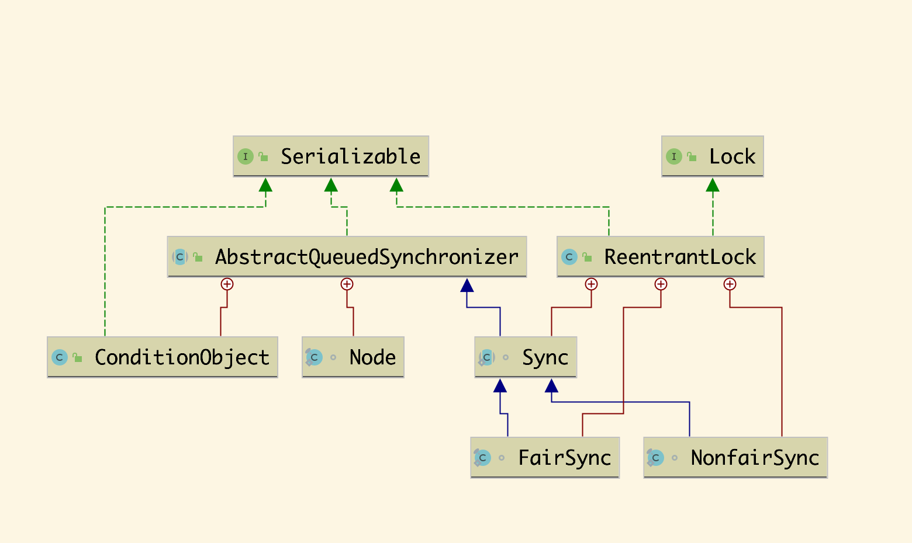

### ReentrantLock源码分析

#### 相关知识

**1.ReentrantLock概念**

`ReentrantLock`是实现了`Lock`接口的类，是一个可重入锁，用来解决多线程应用中的资源的同步性问题。它是`JUC`(java.util.concurrent)中最核心的类。

**2.相关类图**



#### 简单使用

```java
public class ReentrantLockDemo {
  private static Lock lock = new ReentrantLock();
  
  public static void main(String[] args) {
    lock.lock();
    try {
      //do somethings
    } finally {
      lock.unlock();
    }
  }
}
```

**分析：** 使用`lock.lock()`方法，会获取当前锁的对象，`lock.unlock()`会释放锁对象。


#### 底层源码分析

`ReentrantLock`实现互斥锁主要是依赖内部的`AbstractQueueSynchronized`工具类来完成线程同步的功能。

**具体源码**


**争抢锁的过程**

以`NonFairSync`非公平锁为例。

```java
final void lock() {
  //这里首先根据CAS设置当前的state，期望是0，设置为1
  //state保存的是当前锁的状态0表示没有线程获取锁，1表示有线程获
  //取当前锁,大于1表示重入
  if(compareAndSetState(0,1))
    //如果设置成功，则把当前线程设置为独占锁
    setExclusiveOwnerThread(Thread.currentThread());
  else 
    acquire(1);
}

```


```java
public final void acquire(int arg){
  if(!tryAcquire(arg) && acquireQueued(addWaiter(Node.EXCLUSIVE), arg)) 
    selfInterrupt();
}
```

这里的代码表示如果`tryAcquire`方法尝试获取锁失败，那么就调用`acquireQueued`方法将当前线程加入到同步队列中。其中`tryAcquire`方法如下。


```java
protected final boolean tryAcquire(int acquires) {
            return nonfairTryAcquire(acquires);
        }
final boolean nonfairTryAcquire(int acquires) {
            final Thread current = Thread.currentThread();
            int c = getState();
  //这里表示当前state=0，没有线程获取锁，当前线程可以直接获取锁
            if (c == 0) {
                if (compareAndSetState(0, acquires)) {
                    setExclusiveOwnerThread(current);
                    return true;
                }
            }
  	//这里表示如果独占锁与当前线程一样，则state会+1，即重入
            else if (current == getExclusiveOwnerThread()) {
                int nextc = c + acquires;
                if (nextc < 0) // overflow
                    throw new Error("Maximum lock count exceeded");
                setState(nextc);
                return true;
            }
            return false;
        }
```


再看`addWaiter`方法之前，先要介绍一下，`AQS`中维护的双向链表队列每一个元素都是一个`Node`节点，节点中保存了当前线程`thread`下一个节点`next`,前一个节点`prev`以及当前的等待状态`waitStatus`,`waitStatus`有以下几种状态

- CANCELLED = 1 表示取消
- SIGNAL = -1 标记当前的节点保存的线程需要`unpark`
- CONDITION = -2 表示当前节点所在线程在`Condition`队列中
- PROPAGATE = -3共享模式下，该状态的线程处于可运行状态

`addWaiter(Node.EXCLUSIVE)`的具体实现

```java
//当前方法会创建一个节点并加入到AQS队列中
private Node addWaiter(Node mode) {
        Node node = new Node(Thread.currentThread(), mode);
        // Try the fast path of enq; backup to full enq on failure
  //tail指向同步队列的最后一个node，这里第一次为空，会走enq方法,当有其他线程再次竞争锁的时候，会通过下面的代码添加到队列中，并且更新tail为新的node
        Node pred = tail;
        if (pred != null) {
            node.prev = pred;
            if (compareAndSetTail(pred, node)) {
                pred.next = node;
                return node;
            }
        }
        enq(node);
        return node;
    }
```

```java
private Node enq(final Node node) {
  //死循环，会遍历2次，一次初始化，一次设置第一个node的next，prev属性
        for (;;) {
            Node t = tail;
            if (t == null) { // Must initialize
              //第一次t为空，将head设置为一个新的node，不包含thread的node
                if (compareAndSetHead(new Node()))
                  //把队列的tail也设置成node
                    tail = head;
            } else {
              //此时队列为空，将新加入的node的prev设置为tail
                node.prev = t;
              //通过CAS设置队列的tail为当前node
                if (compareAndSetTail(t, node)) {
                  //设置tail的下一个节点也为node
                    t.next = node;
                    return t;
                }
            }
        }
    }
```


`addWaiter`方法执行完成后，再调用`acquireQueued`方法去竞争锁

```java
final boolean acquireQueued(final Node node, int arg) {
        boolean failed = true;
        try {
            boolean interrupted = false;
          //死循环，只有当当前线程的prev是head，也就是自己是队列中的第一个node，且争抢到锁之后才会退出
            for (;;) {
                final Node p = node.predecessor();
                if (p == head && tryAcquire(arg)) {
                    setHead(node);
                    p.next = null; // help GC
                    failed = false;
                    return interrupted;
                }
              //shouldParkAfterFailedAcquire
              //判断是否要在获取锁失败之后挂起锁，主要是通过
              //CAS将当前节点的前置节点的wait设置为SIGNAL
              //parkAndCheckInterrupt方法调用
              //LockSupport.park()方法将当前线程挂起，
              //并且返回当前线程是否被中断的标记，如果被中断
              //了，则会在上面的acquire方法中调用
              //selfInterrupt()方法,重新将线程设置为可中
              //断的状态，这里主要是因为被挂起的线程不能响应中
							 //断，所以要记录下来，并且在被唤醒的时候重新设
              //置
                if (shouldParkAfterFailedAcquire(p, node) &&parkAndCheckInterrupt())
                    interrupted = true;
            }
        } finally {
            if (failed)
                cancelAcquire(node);
        }
    }
```


下面来看一下**释放锁的过程**

`lock.unlock`方法内部调`ReentrantLock`中`AQS`的`release()`方法

```java
public final boolean release(int arg) {
  //如果当前线程只重入一次，tryRelease会返回true
  if (tryRelease(arg)) {
    Node h = head;
    //如果head不为空，且head的waitStatus=SIGNAL（在前面
    //shouldParkAfterFailedAcquire方法中设置了）
    //unparkSuccessor解锁继任者（head指向的node）
    //内部主要调用LockSupport.unpark(s.thread)方法
    if (h != null && h.waitStatus != 0)
      unparkSuccessor(h);
    return true;
  }
  return false;
}
protected final boolean tryRelease(int releases) {
  int c = getState() - releases;
  if (Thread.currentThread() != getExclusiveOwnerThread())
    throw new IllegalMonitorStateException();
  boolean free = false;
  if (c == 0) {
    free = true;
    //将当前的独占锁置为空
    setExclusiveOwnerThread(null);
  }
  setState(c);
  return free;
}


```


`unparkSuccessor()`方法把当前处在队列的第一个节点所包含的thread唤醒，那么这个线程会继续执行

`acquireQueued`中的死循环，通过CAS获取锁。


**到此整个流程就结束了**。

