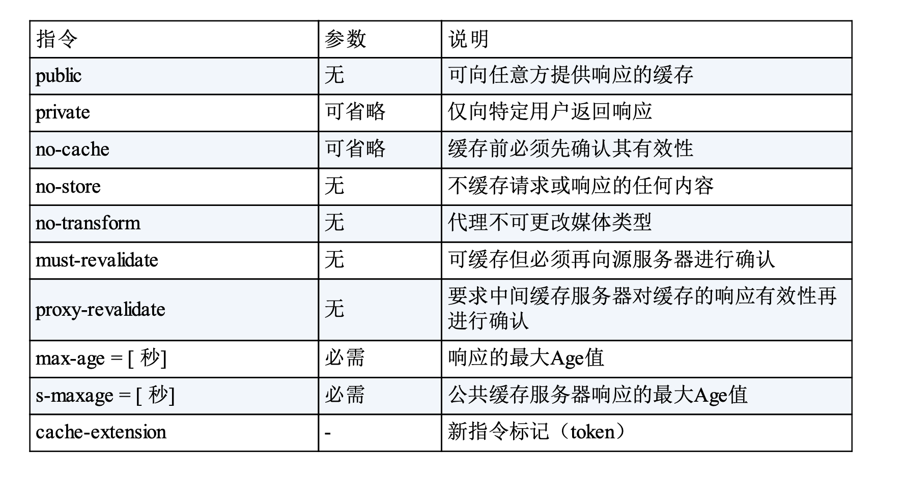

### 1.网络模型 应用层、传输层、网络层、数据链路层、物理层

网络层：HTTP协议、FTP协议、DNS 协议
传输层：TCP协议、UDP协议
网络层： IP（internet protocol）协议
数据链路层：硬件
注意： TCP/IP协议是互联网各类协议族的总称

### 2.一个HTTP请求的过程

* 首先作为发送端的客户端在应用层 (HTTP 协议)发出一个想看某个 Web 页面的 HTTP 请求。

接着，为了传输方便，在传输层(TCP 协议)把从应用层处收到的数 据(HTTP 请求报文)进行分割，并在各个报文上打上标记序号及端 口号后转发给网络层。
在网络层(IP 协议)，增加作为通信目的地的 MAC 地址后转发给链 路层。这样一来，发往网络的通信请求就准备齐全了。
接收端的服务器在链路层接收到数据，按序往上层发送，一直到应用 层。当传输到应用层，才能算真正接收到由客户端发送过来的 HTTP 请求。
TCP协议通信的三次握手
syn synchronize ack acknowledgement

### 3.代理、网关、隧道

**代理**
代理是一种有转发功能的应用程序，它扮演了位于服务器和客户 端“中间人”的角色，接收由客户端发送的请求并转发给服务器，同时 也接收服务器返回的响应并转发给客户端。
每次通过代理服务器转发请求或响应时，会追加写入 Via 首 部信息

缓存代理
代理转发响应时，缓存代理(Caching Proxy)会预先将资源的副本 (缓存)保存在代理服务器上。
当代理再次接收到对相同资源的请求时，就可以不从源服务器那里获 取资源，而是将之前缓存的资源作为响应返回。
透明代理
转发请求或响应时，不对报文做任何加工的代理类型被称为透明代理 (Transparent Proxy)。反之，对报文内容进行加工的代理被称为非 透明代理。
**网关**
网关是转发其他服务器通信数据的服务器，接收从客户端发送来的请 求时，它就像自己拥有资源的源服务器一样对请求进行处理。有时客 户端可能都不会察觉，自己的通信目标是一个网关。网关的工作机制和代理十分相似。而网关能使通信线路上的服务器提供非 HTTP 协议服务。
**隧道**
隧道是在相隔甚远的客户端和服务器两者之间进行中转，并保持双方 通信连接的应用程序。

### 4.HTTP 首部字段（请求头）

*   通用首部字段

*   请求首部字段

*   响应首部字段

*   实体首部字段

 **Cache-Control 缓存指令** 
*   请求指令

*   响应指令

**Connecttion 持久连接  不再转发给代理**

  * Connection: 不再转发的首部字段名
  * Connection: close 请求后断开链接
  * connection: Keep-Alive HTTP/1.1默认链接是持久连接

 **Pragma 向后兼容缓存的**
 HTTP/1.1中直接使用Cache-Control 

 **Trailer**

 **Transfer-Encoding**
 规定了传输报文主体采用的编码，仅对分块传输编码有效

 **Upgrade**
 检测HTTP协议及其他协议是否可以使用更高的版本进行通信

 **Via**
 追踪客户端与服务器之间的请求和响应报文的传输路径
 

**Content-Type 报文主体的对象类型**  
* text/html 

**Accept**
用户代理能够处理的媒体类型及媒体 类型的相对优先级

**Accept-Charset**
通知服务器用户代理支持的字符集及 字符集的相对优先顺序

**Accept-Encoding**
告知服务器用户代理支持的内容编码及 内容编码的优先级顺序

**Accept-Language**
用来告知服务器用户代理能够处理的自然 语言集(指中文或英文等)，以及自然语言集的相对优先级。可一次 指定多种自然语言集。

**Host**
首部字段 Host 会告知服务器，请求的资源所处的互联网主机名和端 口号。Host 首部字段在 HTTP/1.1 规范内是唯一一个必须被包含在请 求内的首部字段。

**If-Match**
首部字段 If-Match，属附带条件之一，它会告知服务器匹配资源所用 的实体标记(ETag)值

*形如 If-xxx 这种样式的请求首部字段，都可称为条件请求。服务器接 收到附带条件的请求后，只有判断指定条件为真时，才会执行请求。*

如果在**If-Modified-Since** 字段指定的日期时间后，资源发生了 更新，服务器会接受请求

**Max-Forward:**
请求被转发的次数，每次减1，到0后直接返回

**Proxy-Authorization** 
接收到从代理服务器发来的认证质询时，客户端会发送包含首部字段 Proxy-Authorization 的请求，以告知服务器认证所需要的信息。

**Range**
Range: bytes=5001-10000

**Referer**
首部字段 Referer 会告知服务器请求的原始资源的 URI。

**ETag**
服务器返回的实体标识，将资源以字符串形式做唯一性标识的方式

**Location: http://www.test.com**
重定向指定的url

**Retry-After： 120**
服务端告知客户端在多久之后再次发送请求

**Server: Apache/2.2.17 (Unix)**
服务器上HTTP服务器应用程序的信息

**Vary**
当代理服务器接收到带有 Vary 首部字段指定获取资源的请求时，如果使用的 Accept-Language 字段的值相同，那么就直接从缓存返回响应。反之，则需要先从源服务器端获取资源后才能作为响应返回

**Allow: GET, HEAD**
告知客户端服务器支持的HTTP请求方式

**Content-Encoding: gzip**
告知客户端服务器对实体的主体部分的编码方式

**Content-Location: http://abc.html**
返回的资源对应的URI

**Content-Type: text/html; charset=UTF-8**
实体主体内对象的媒体类型 和 Accept 字段使用形式一样
				
**Expires: Wed, 04 Jul 2020 08:33:22 GMT**
资源失效日期，超过该时间后，请求会转向源服务器 优先级低于Cache-Control

**Set-Cookie: status=enable; expires=Tue, 04 Jul 2020 07:22:22**

**Cookie: status=enable**
首部字段 Cookie 会告知服务器，当客户端想获得 HTTP 状态管理支 持时，就会在请求中包含从服务器接收到的 Cookie。接收到多个 Cookie 时，同样可以以多个 Cookie 形式发送。

### 5.HTTP请求的安全机制

1.**加密通道** 
SSL(Secure Socket Layer) 安全套接层
TLS （Transport Layer Security) 安全层传输协议

2.**加密报文内容**

3.**HTTPS**:

* HTTP加上加密处理和认证以及完整性保护后即是HTTPS（HTTP secure）
* 通常，HTTP 直接和 TCP 通信。当使用 SSL 时，则演变成先和 SSL 通 信，再由 SSL 和 TCP 通信了。简言之，所谓 HTTPS，其实就是身披 SSL 协议这层外壳的 HTTP。

* 和使用 HTTP 相比，网络负载可能会变慢 2 到 100 倍。除去和 TCP 连接、发送 HTTP 请求 • 响应以外，还必须进行 SSL 通信， 因此整体上处理通信量不可避免会增加。
* 另一点是 SSL 必须进行加密处理。在服务器和客户端都需要进行 加密和解密的运算处理。因此从结果上讲，比起 HTTP 会更多地 消耗服务器和客户端的硬件资源，导致负载增强。

### 6.确认访问用户身份的认证

#### 1.Basic认证（基本认证）

- 客户端请求浏览器后，浏览器会返回状态码401 `Authorization Required` 并且返回`WWW-Authenticate` 的首部字段的响应。
- 客户端将用户ID和密码（以冒号链接，并且经过Base64编码处理）发送给服务器。`Authorization: Basic xxxxxxxxx`
- 服务端对`Authorization`进行解析并验证用户，正确则返回一条包含`Request-URI`资源的响应

#### 2.Digest认证

- 客户端请求服务器后，服务器返回状态码401 和 `Authorization Required` 并且返回`WWW-Authenticate` 的首部字段的响应。

- 客户端将包含DIGEST认证必须的首字段`Authorization`信息。首部字段包含`username` 、`realm`、`nonce`、`uri`和`response`的字段信息。

- 服务端对`Authorization`进行解析并验证用户，正确则返回一条包含`Request-URI`资源的响应。并且会在首部字段`Authentication-Info`写入一些认证成功的相关信息。

	 

	####  3.SSL客户端认证

	SSL 即是HTTPS请求的认证过程，客户端必须事先将可证书安装。

- 服务器接收到需要认证资源的请求，发送`Certificate Request`报文，要求客户端提供客户端证书。

- 客户端将证书信息以`Client Certificate`报文方式发送给服务器。

- 服务端验证通过后方可领取证书内客户端的公开密钥，开始HTTPS通信。

	 

	#### 4.基于表单验证

	多数web程序使用的认证方式，通过表单登录服务器，通过`session`和`cookie`的方式进行验证。

### 7.基于HTTP的追加协议

##### **1.HTTP的瓶颈**

- 一条链接上只能发送一个请求
- 请求只能从客户端开始，服务器进行响应
- 请求、响应的首部未经压缩，内容越多，传输越慢
- 每次发送相同的首部信息，造成资源的浪费
- 压缩格式可以任选，不是强制压缩发送

##### **2.解决办法**

- **Ajax**(Asynchronous JavaScript and XML) 请求，通过异步加载的方式，来局部的更新web应用的页面

- **Comet**客户端向服务器发起请求后，服务器不会立即响应，而是先将响应挂起，等到有内容更新的时候，才会向客户端返回响应。但是这样会消耗服务器的资源。

- **SPDY** 在TCP/IP的应用层与传输层之间通过新加会话层的形式运作。通信中使用SSL加密。它有以下功能：

	​	**多路复用：**单一的TCP链接可以无限制的处理多个HTTP请求，TCP处理的效率得到提高。

	​	**赋予请求优先级：**可以给请求分配优先级顺序。

	​	**压缩HTTP首部**：压缩请求和响应的首部，提高效率。

	​	**支持推送功能：**服务器可以直接发送数据到客户端。

	​	**服务器提示功能：**服务器可以主动提示客户端请求所需的资源。

##### 3.WebSocket协议

WebSocket通信协议建立后，客户端和服务端可以互相发送任意格式的数据。

主要特点：

- 推送功能
- 减少通信量 建立连接后会一直保持连接，且首部信息很小。建立连接只需要一次握手。

##### 4.HTTP2.0

HTTP/2协议是基于HTTPS的，所以它的安全性有保障。相比HTTP/1.1性能上的改进

- **头部压缩**：会压缩头部，如果同时发出多个请求，他们的头是一样的或者相似的，协议会帮你消除重复的部分
- **二进制格式**： 不再采用HTTP/1.1中的纯文本形式的报文，全面采用了二进制的格式，把头和请求体称为头信息帧和数据帧。二进制增加了数据传输的效率。
- **数据流**：数据包不是按照顺序发送的，同一个连接里面连接的数据包，可能属于不同的回应。每个请求或回应的所有数据包称为一个数据流。客户端还可以指定数据流的优先级。
- **多路复用**：可以在一个连接中并发的发送多个请求，而不用按照顺序一一对应的响应。降低了延迟，大幅度的提高了连接的利用率。
- **服务器推送：**服务器可以主动向客户端发送数据。

##### 5.HTTP/3

- 把传输层的TCP协议改成了UDP协议，TCP协议是可靠的，UDP不是可靠的协议，但是基于UPD的QUIC协议可以实现类似TCP的可靠性传输。

- HTTPS 要建立一个连接，要花费 6 次交互，先是建立三次握手，然后是 `TLS/1.3` 的三次握手。QUIC 直接把以往的 TCP 和 `TLS/1.3` 的 6 次交互**合并成了 3 次，减少了交互次数**。

